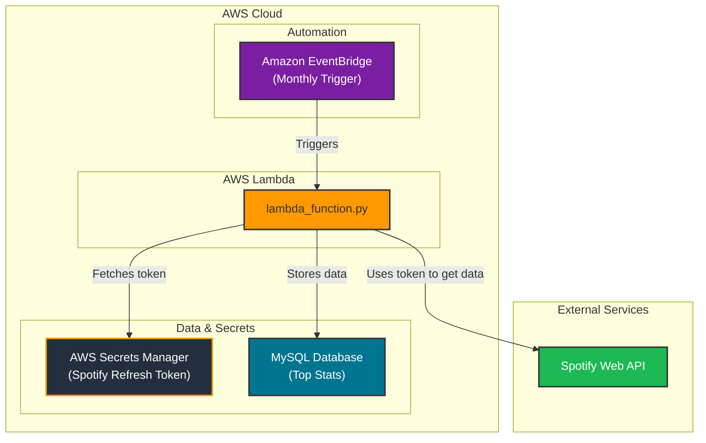

# Personal Spotify Stats Backup

This project, "Personal Spotify Stats Backup," is designed to automatically fetch your top Spotify tracks, artists, and albums on a monthly basis and store this data in a **MySQL** database. It runs as an **AWS Lambda function**, providing a completely automated and serverless solution for backing up your personal music statistics.

---

## Tech Stack & Architecture

The project is built on a serverless architecture using AWS services. An Amazon EventBridge rule triggers the AWS Lambda function on a monthly schedule. The Lambda function, written in Python, then orchestrates the data collection and storage process.

It securely retrieves a Spotify refresh token from **AWS Secrets Manager**, uses it to authenticate with the **Spotify Web API**, and fetches your top artists and tracks. The data is then processed and stored in a **MySQL** database for historical analysis.



---

## Features

- **Automated Monthly Backups:** Runs automatically on a schedule, creating a reliable monthly snapshot of your listening habits.
- **Top Data Collection:** Fetches your top 50 tracks and artists from the last month via the Spotify Web API.
- **Top Album Calculation:** Intelligently determines your top albums based on the appearance of their tracks in your top tracks list.
- **Secure Credential Management:** Leverages **AWS Secrets Manager** to securely store and manage your Spotify API refresh token, avoiding hardcoded secrets.
- **Persistent Storage:** Saves all collected data into a **MySQL** database, allowing for long-term historical tracking and analysis.
- **Serverless Design:** Built to run on **AWS Lambda**, eliminating the need to manage servers and ensuring cost-effective operation.

---

## Project Structure

```
.
├── Managers/
│   ├── SpotifyAuthorizationManager.py  # Handles Spotify API authentication and token management.
│   ├── SpotifyAPIManager.py          # Manages calls to the Spotify Web API to fetch data.
│   └── DatabaseManager.py              # Handles the connection and data insertion into the MySQL database.
├── Types/
│   ├── Artist.py, Track.py, etc.       # Data classes representing the Spotify objects.
├── lambda_function.py                  # The main entry point for the AWS Lambda function.
├── SpotifyRefreshTokenGenerator.py   # Script to generate the initial Spotify refresh token.
├── requirements.txt                    # Project dependencies.
├── sample.env                          # Sample environment variables file.
└── README.md                           # This file.
```

---

## Setup and Installation

### 1. Prerequisites

- An **AWS Account** with access to Lambda, Secrets Manager, and EventBridge.
- A **MySQL Database** (e.g., Amazon RDS, or any other accessible MySQL instance).
- **Python 3.9** or later.
- **Git**.

### 2. Clone the Repository

```bash
git clone <repository_url>
cd personal-spotify-stats-backup
```

### 3. Spotify API Application Setup

1.  Go to the [Spotify Developer Dashboard](https://developer.spotify.com/dashboard/).
2.  Log in and create a new application.
3.  Note down your **Client ID** and **Client Secret**.
4.  In the application settings, add a **Redirect URI**. For local development and generating your initial token, `http://localhost:8888/callback` is a standard choice.

### 4. Generate a Spotify Refresh Token

The `SpotifyRefreshTokenGenerator.py` script simplifies the process of getting your initial `refresh_token`, which is required for unattended authentication.

1.  Create a `.env` file in the root directory and add your Spotify credentials:
    ```
    CLIENT_ID=your_spotify_client_id
    CLIENT_SECRET=your_spotify_client_secret
    ```
2.  Install dependencies and run the script:
    ```bash
    pip install -r requirements.txt
    python SpotifyRefreshTokenGenerator.py
    ```
3.  Follow the prompts in your browser to authorize your account. The script will print the `refresh_token` to the console. **Save this token securely.**

### 5. AWS and Environment Configuration

#### AWS Secrets Manager

1.  Navigate to **AWS Secrets Manager** in your AWS console.
2.  Create a new secret to store your Spotify refresh token.
3.  Choose **"Other type of secret"** and create a key-value pair. The `SpotifyAPIManager.py` expects the key to be `spotify_refresh_token`:
    - **Key:** `spotify_refresh_token`
    - **Value:** `YOUR_REFRESH_TOKEN_FROM_STEP_4`
4.  Give the secret a name (e.g., `SpotifyRefreshToken`) and note it down.

#### Environment Variables for Lambda

When you create your Lambda function, you will need to set the following environment variables. You can use the `sample.env` file as a template.

- `CLIENT_ID`: Your Spotify application Client ID.
- `CLIENT_SECRET`: Your Spotify application Client Secret.
- `REDIRECT_URI`: The redirect URI you set in the Spotify Developer Dashboard.
- `SECRET_NAME`: The name of the secret you created in AWS Secrets Manager.
- `DB_HOST`: The endpoint for your MySQL database.
- `DB_USERNAME`: Your database username.
- `DB_PASSWORD`: Your database password.
- `DB_NAME`: The name of your database.
- `DB_PORT`: The port for your database (usually `3306`).

---

## Deployment

### 1. Create a Deployment Package

The following script packages the Python code and its dependencies into a `.zip` file suitable for uploading to AWS Lambda.

**`deploy.sh`**
```bash
#!/bin/bash

# Exit immediately if a command exits with a non-zero status.
set -e

# Define variables
PACKAGE_DIR="package"
ZIP_FILE="deployment_package.zip"

echo "--- Starting deployment packaging ---"

# Create a clean directory for the package
echo "Creating a clean package directory..."
rm -rf $PACKAGE_DIR $ZIP_FILE
mkdir -p $PACKAGE_DIR

# Install dependencies into the package directory
echo "Installing dependencies from requirements.txt..."
pip install --target $PACKAGE_DIR -r requirements.txt

# Copy the Lambda function and other necessary Python files
echo "Copying source files..."
cp lambda_function.py $PACKAGE_DIR/
cp -r Managers $PACKAGE_DIR/
cp -r Types $PACKAGE_DIR/

# Create the deployment zip file
echo "Creating deployment package: $ZIP_FILE..."
cd $PACKAGE_DIR
zip -r ../$ZIP_FILE .
cd ..

# Clean up the package directory
echo "Cleaning up..."
rm -rf $PACKAGE_DIR

echo "--- Deployment package created successfully: $ZIP_FILE ---"
```

Make the script executable and run it:
```bash
chmod +x deploy.sh
./deploy.sh
```

### 2. Deploy to AWS Lambda

You can create and update your Lambda function using the AWS Management Console or the AWS CLI.

#### Using AWS CLI

**To create the Lambda function (run this once):**
*(Replace the placeholder values with your own information)*

```bash
aws lambda create-function \
  --function-name PersonalSpotifyStatsBackup \
  --runtime python3.9 \
  --role arn:aws:iam::YOUR_AWS_ACCOUNT_ID:role/YOUR_LAMBDA_EXECUTION_ROLE \
  --handler lambda_function.lambda_handler \
  --zip-file fileb://deployment_package.zip \
  --environment "Variables={CLIENT_ID=your_client_id,CLIENT_SECRET=your_client_secret,REDIRECT_URI=your_redirect_uri,SECRET_NAME=your_secret_name,DB_HOST=your_db_host,DB_USERNAME=your_db_username,DB_PASSWORD=your_db_password,DB_NAME=your_db_name,DB_PORT=3306}" \
  --timeout 60 \
  --memory-size 256
```

**To update the function's code:**
*(This is the command you will use most often to deploy new versions of your code)*

```bash
aws lambda update-function-code \
  --function-name PersonalSpotifyStatsBackup \
  --zip-file fileb://deployment_package.zip
```

### 3. Schedule the Lambda Function

To automate the backup, create an **Amazon EventBridge** rule that triggers your Lambda function on a schedule (e.g., once a month).

---

## License

This project is licensed under the MIT License - see the [LICENSE](LICENSE) file for details.