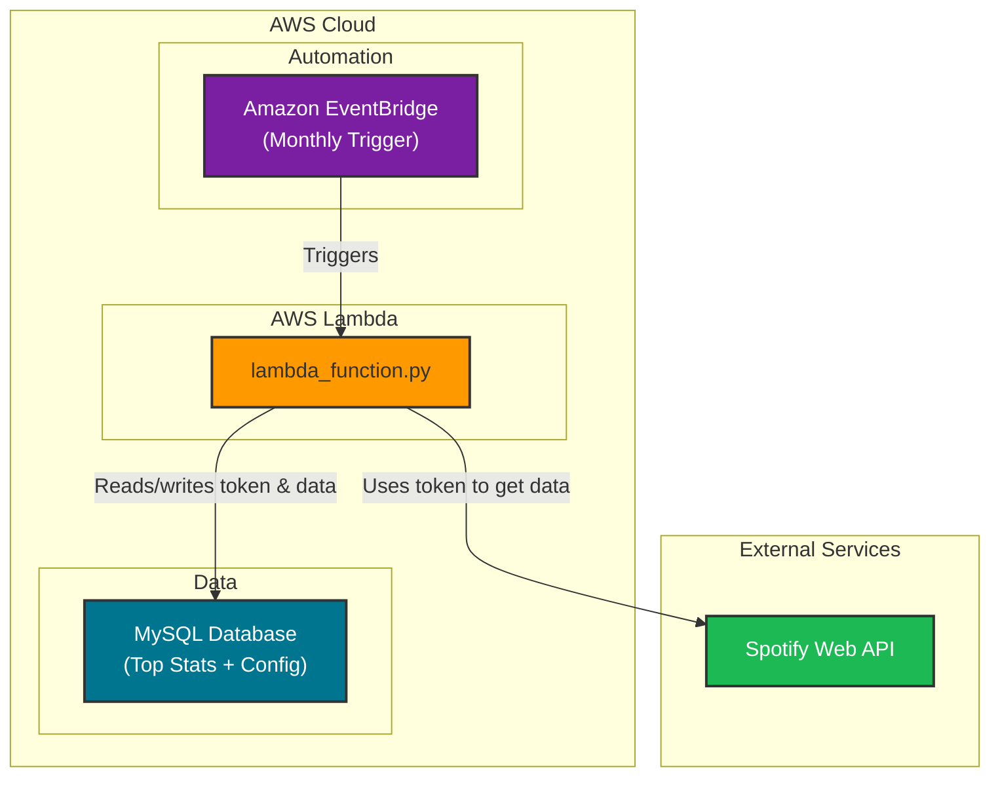

# Personal Spotify Stats Backup

This project, "Personal Spotify Stats Backup," is designed to automatically fetch your top Spotify tracks, artists, and albums on a monthly basis and store this data in a **MySQL** database. It runs as an **AWS Lambda function**, providing a completely automated and serverless solution for backing up your personal music statistics.

---

## Tech Stack & Architecture

The project is built on a serverless architecture using AWS services. An Amazon EventBridge rule triggers the AWS Lambda function on a monthly schedule. The Lambda function, written in Python, then orchestrates the data collection and storage process.

It retrieves a Spotify refresh token stored in the **MySQL** database, uses it to authenticate with the **Spotify Web API**, and fetches your top artists and tracks. The data is then processed and stored back in the database for historical analysis.



---

## Features

- **Automated Monthly Backups:** Runs automatically on a schedule, creating a reliable monthly snapshot of your listening habits.
- **Top Data Collection:** Fetches your top 50 tracks and artists from the last month via the Spotify Web API.
- **Top Album Calculation:** Intelligently determines your top albums based on the appearance of their tracks in your top tracks list.
- **Secure Credential Management:** Stores the Spotify API refresh token in the MySQL database's `config` table, keeping secrets out of source code.
- **Persistent Storage:** Saves all collected data into a **MySQL** database, allowing for long-term historical tracking and analysis.
- **Serverless Design:** Built to run on **AWS Lambda**, eliminating the need to manage servers and ensuring cost-effective operation.

---

## Project Structure

```
.
├── Managers/
│   ├── SpotifyAuthorizationManager.py  # Handles Spotify API authentication and token management.
│   ├── SpotifyAPIManager.py            # Manages calls to the Spotify Web API to fetch data.
│   └── DatabaseManager.py              # Handles the connection and data insertion into the MySQL database.
├── Types/
│   ├── Artist.py, Track.py, etc.       # Data classes representing the Spotify objects.
├── terraform/                          # Infrastructure-as-code for AWS deployment.
│   ├── main.tf                         # Lambda function, Layer, CloudWatch log group.
│   ├── variables.tf                    # Input variable declarations.
│   ├── iam.tf                          # IAM role and policies.
│   ├── eventbridge.tf                  # Monthly EventBridge schedule.
│   └── README.md                       # Terraform usage instructions.
├── lambda_function.py                  # The main entry point for the AWS Lambda function.
├── SpotifyRefreshTokenGenerator.py     # Script to generate the initial Spotify refresh token.
├── requirements.txt                    # Project dependencies.
├── sample.env                          # Sample environment variables file.
└── README.md                           # This file.
```

---

## Setup and Installation

### 1. Prerequisites

- An **AWS Account** with access to Lambda, RDS, and EventBridge.
- **Terraform** ≥ 1.0 — [Install guide](https://developer.hashicorp.com/terraform/install).
- A **MySQL Database** (e.g., Amazon RDS, or any other accessible MySQL instance).
- **Python 3.9** or later.
- **Git**.

### 2. Clone the Repository

```bash
git clone <repository_url>
cd personal-spotify-stats-backup
```

### 3. Spotify API Application Setup

1.  Go to the [Spotify Developer Dashboard](https://developer.spotify.com/dashboard/).
2.  Log in and create a new application.
3.  Note down your **Client ID** and **Client Secret**.
4.  In the application settings, add a **Redirect URI**. For local development and generating your initial token, `http://localhost:8888/callback` is a standard choice.

### 4. Generate a Spotify Refresh Token

The `SpotifyRefreshTokenGenerator.py` script simplifies the process of getting your initial `refresh_token`, which is required for unattended authentication.

1.  Create a `.env` file in the root directory and add your Spotify credentials:
    ```
    CLIENT_ID=your_spotify_client_id
    CLIENT_SECRET=your_spotify_client_secret
    ```
2.  Install dependencies and run the script:
    ```bash
    pip install -r requirements.txt
    python SpotifyRefreshTokenGenerator.py
    ```
3.  Follow the prompts in your browser to authorize your account. The script will print the `refresh_token` to the console. **Save this token securely.**

### 5. AWS and Environment Configuration

#### Store the Refresh Token in the Database

The application stores its Spotify refresh token in the MySQL database's `config` table. Insert your initial token:

```sql
INSERT INTO config (config_key, config_value)
VALUES ('spotify_refresh_token', 'YOUR_REFRESH_TOKEN_FROM_STEP_4');
```

#### Environment Variables for Lambda

These are managed automatically by Terraform (see `terraform/terraform.tfvars`). For local development, use the `sample.env` file as a template.

- `CLIENT_ID`: Your Spotify application Client ID.
- `CLIENT_SECRET`: Your Spotify application Client Secret.
- `REDIRECT_URI`: The redirect URI you set in the Spotify Developer Dashboard.
- `DB_HOST`: The endpoint for your MySQL database.
- `DB_USERNAME`: Your database username.
- `DB_PASSWORD`: Your database password.
- `DB_NAME`: The name of your database.
- `DB_PORT`: The port for your database (usually `3306`).

---

## Deployment (Terraform)

Infrastructure is managed with **Terraform**. See [`terraform/README.md`](terraform/README.md) for full details.

### First-Time Setup

```bash
cd terraform/

# 1. Fill in your VPC/subnet/security group IDs in terraform.tfvars
#    (look for the TODO comments)

# 2. Initialize Terraform
terraform init

# 3. Import your existing Lambda function
terraform import aws_lambda_function.spotify_backup PersonalSpotifyStatsBackup

# 4. Preview and apply
terraform plan
terraform apply
```

### Deploying Code Changes

```bash
cd terraform/
terraform apply
```

Terraform automatically packages your code, uploads it to Lambda, and updates the function.

### What Terraform Manages

- **Lambda Function** with VPC networking and environment variables
- **Lambda Layer** for Python dependencies (from `requirements.txt`)
- **IAM Role** with least-privilege policies
- **EventBridge Rule** for the monthly schedule
- **CloudWatch Log Group** with configurable retention

---

## License

This project is licensed under the MIT License - see the [LICENSE](LICENSE) file for details.